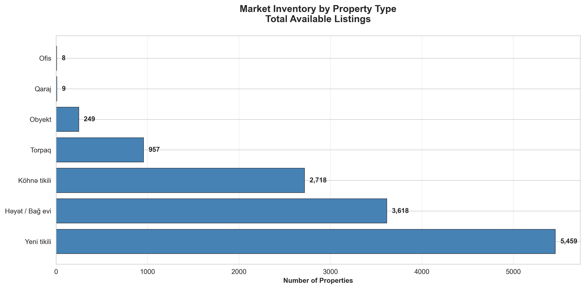
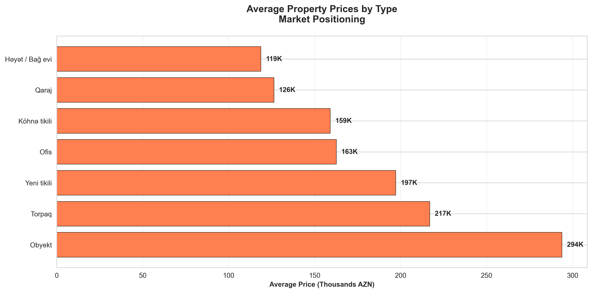
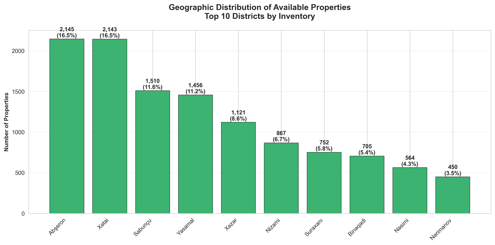
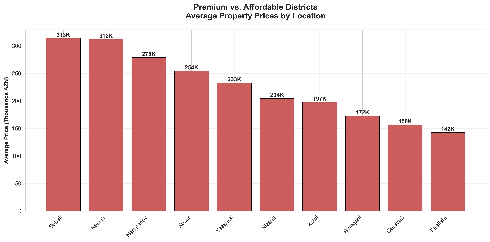
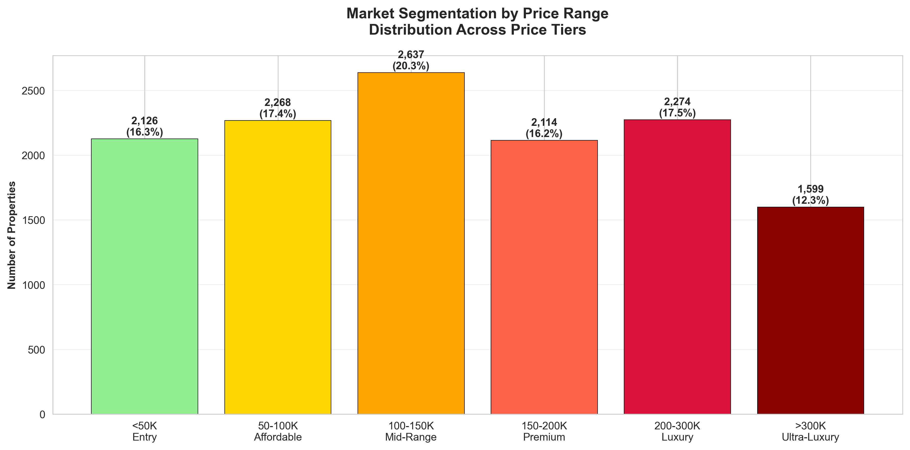
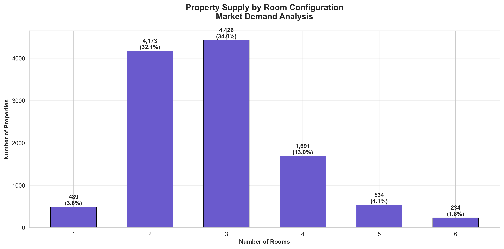
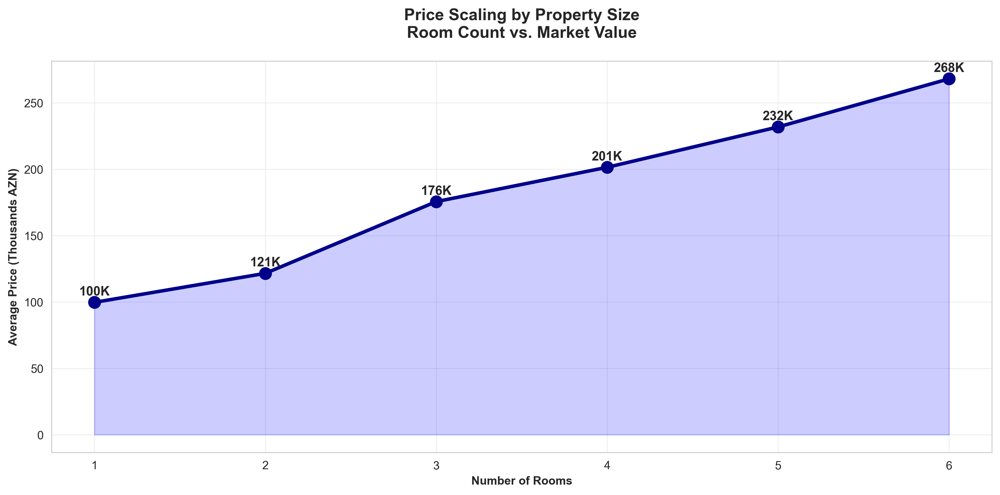
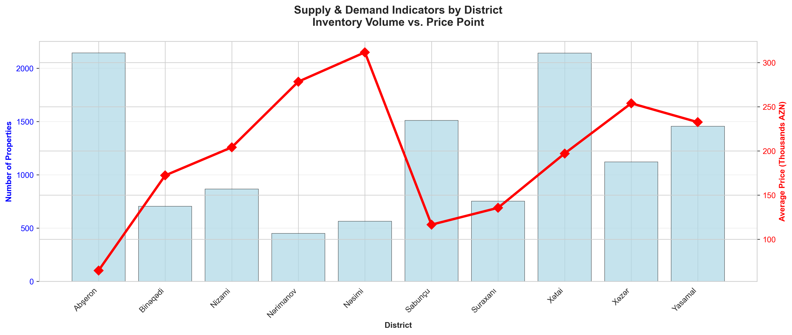
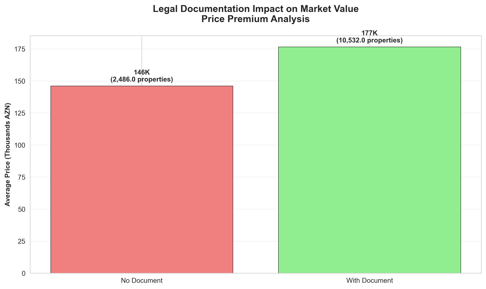
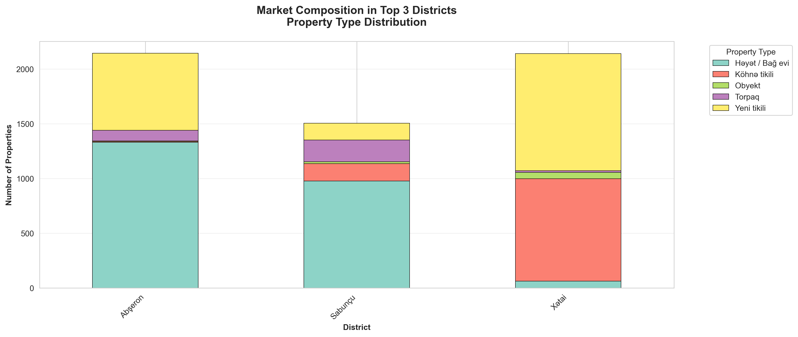

# Baku Real Estate Market Analysis
## Strategic Insights for Investment & Business Development

**Analysis Date:** December 2025
**Market Coverage:** 13,018 Active Property Listings
**Geographic Focus:** Baku, Azerbaijan

---

## Executive Summary

This analysis examines the current state of Baku's real estate market based on 13,018 active property listings. The findings reveal significant opportunities in underserved price segments, geographic expansion potential, and clear market concentration patterns that can inform strategic decision-making.

**Key Highlights:**
- Market dominated by new construction (42% of inventory)
- Average property price: 171,000 AZN (Median: 142,000 AZN)
- Strong documentation compliance (81% of listings)
- Geographic concentration in 3 districts controls 44% of market
- Mid-range segment (100-150K AZN) represents largest opportunity

---

## Market Composition: What's Available

### What This Shows

The market is heavily weighted toward new construction properties (Yeni tikili), representing over 5,400 listings or 42% of total inventory. Garden/yard homes (Həyət / Bağ evi) comprise the second-largest segment at 28%, followed by older construction properties at 21%.

### Why This Matters

This distribution reveals **two distinct market dynamics**:

1. **Urban Development Focus**: The dominance of new construction indicates ongoing urbanization and modern housing demand
2. **Suburban/Rural Presence**: The significant garden home inventory (3,600+ properties) suggests substantial supply in peripheral areas

### Business Implications

- **For Developers**: The market may be approaching saturation in new construction; differentiation will be key
- **For Investors**: Garden home inventory presents potential value opportunities if priced below new construction
- **For Agents**: Specialized expertise in either urban new builds or suburban properties could capture niche markets

---

## Price Positioning: Premium vs. Value Markets

### What This Shows

New villa properties command the highest average prices at approximately 270K AZN, nearly 60% above the market average. Cottage-style homes follow at 224K AZN, while new construction apartments average 189K AZN. Garden homes, despite representing 28% of inventory, average only 86K AZN—less than half the market average.

### Why This Matters

**Price gaps of this magnitude indicate market segmentation and opportunity:**

- Premium buyers (villas/cottages) operate in a market 2-3x the median price
- Garden homes represent the **value segment**, with prices 50% below market average
- The 3.1x price difference between villas and garden homes suggests different buyer demographics entirely

### Business Implications

**For Investment Strategy:**
- Target the 86K-189K corridor where 60% of transactions occur
- Premium properties (270K+) serve a limited but high-margin market
- Garden homes at 86K average represent entry-level or retirement opportunities

**For Marketing:**
- Premium properties require luxury positioning and exclusive channels
- Mid-market properties need volume-based strategies
- Value properties should emphasize affordability and land ownership

---

## Geographic Distribution: Where the Market Concentrates

### What This Shows

Three districts dominate market inventory:
- **Abşeron**: 2,145 properties (16.5%)
- **Xətai**: 2,143 properties (16.5%)
- **Sabunçu**: 1,510 properties (11.6%)

These three areas alone represent **44% of all available properties**.

### Why This Matters

**Geographic concentration creates both risks and opportunities:**

**Concentration Benefits:**
- Established markets with proven demand
- Better infrastructure and services
- Higher buyer familiarity

**Concentration Risks:**
- Increased competition among sellers
- Potential price pressure from oversupply
- Limited growth potential in saturated markets

### Business Implications

**For Market Entry:**
- Underserved districts (7 districts have <1,000 properties each) may offer less competition
- First-mover advantage possible in developing areas

**For Portfolio Strategy:**
- Diversification across multiple districts reduces concentration risk
- Emerging districts may offer better price appreciation potential

**For Sales/Marketing:**
- Resource allocation should match inventory distribution
- Top 3 districts require strongest sales presence

---

## Premium vs. Affordable: District Price Dynamics

### What This Shows

District pricing varies dramatically:
- **Xətai** commands premium prices (197K AZN average)
- **Nəsimi** and **Yasamal** also position above market average (170-180K)
- **Abşeron**, despite highest inventory, averages only 65K AZN—62% below market average

### Why This Matters

**This reveals a critical market paradox:** The district with the most inventory (Abşeron) has the lowest average prices, while Xətai (similar inventory volume) commands prices 3x higher.

**Key Insight:** High inventory ≠ high prices. Location premium persists regardless of supply.

### Business Implications

**For Buyers:**
- Abşeron offers maximum affordability but may have location tradeoffs
- Xətai provides urban positioning at 3x premium

**For Investors:**
- Abşeron's 65K average suggests high volume, low margin opportunities
- Xətai's 197K average indicates established prestige and price stability

**For Developers:**
- Location selection impacts achievable prices more than product quality
- Premium district positioning can justify 200%+ price premiums

---

## Market Segmentation: Understanding Buyer Categories

### What This Shows

The market distributes relatively evenly across six price tiers:
- **Entry Level** (<50K): 16.3% of market
- **Affordable** (50-100K): 17.4%
- **Mid-Range** (100-150K): 20.3% — **Largest segment**
- **Premium** (150-200K): 16.2%
- **Luxury** (200-300K): 17.5%
- **Ultra-Luxury** (>300K): 12.3%

### Why This Matters

**The relatively balanced distribution indicates a mature, diverse market** serving multiple demographics. The slight concentration in the 100-150K tier suggests this is the "sweet spot" where supply meets demand most efficiently.

**Critical Observation:** Nearly 30% of the market sits in luxury tiers (200K+), indicating substantial high-end activity.

### Business Implications

**For Product Development:**
- Focus on 100-150K tier for highest volume potential
- Don't overlook luxury segment—nearly 4,000 properties at 200K+ shows sustained demand

**For Financing Products:**
- Entry/Affordable tiers (33.7% of market) need accessible financing
- Premium+ buyers (46%) likely pay cash or require specialized lending

**For Market Positioning:**
- Avoid "middle of the road" positioning between segments
- Clearly target one tier with appropriate product features and marketing

---

## Room Configuration: What Buyers Want

### What This Shows

**3-room properties dominate the market** with over 5,000 units (38.5% of inventory). 2-room and 4-room configurations follow at roughly equal levels (20-22% each). Larger properties (5-6+ rooms) represent less than 20% combined.

### Why This Matters

**The 3-room dominance indicates family-oriented market positioning.** This configuration typically serves:
- Small to medium families (2-4 people)
- Professional couples planning for children
- Young families with 1-2 children

**The relatively low supply of 1-room properties (12%) suggests limited studio/bachelor market—a potential opportunity.**

### Business Implications

**For Developers:**
- 3-room configuration is the "standard" product—requires differentiation beyond size
- 1-room market is underserved relative to urban demographic trends
- 5-6 room properties serve niche luxury/large family market

**For Investors:**
- 3-room properties offer best liquidity due to broad appeal
- 1-room properties may appreciate faster if urban density increases
- Larger properties (5-6 rooms) have limited buyer pool but less competition

**For Interior Design/Staging:**
- 3-room properties should showcase family functionality
- 1-2 room units need efficient space utilization emphasis
- Larger homes require lifestyle/prestige positioning

---

## Price-to-Size Relationship: Value Progression

### What This Shows

Average prices increase linearly with room count:
- **1-room**: 83K AZN
- **2-room**: 122K AZN (+47%)
- **3-room**: 166K AZN (+36%)
- **4-room**: 233K AZN (+40%)
- **5-room**: 296K AZN (+27%)
- **6-room**: 371K AZN (+25%)

### Why This Matters

**Each additional room adds approximately 40K-50K AZN on average**, with the increment slightly decreasing at larger sizes. This progression reveals market rationality and helps establish fair value baselines.

**Key Observation:** The jump from 1-room (83K) to 2-room (122K) is the steepest percentage increase (+47%), suggesting buyers place premium value on the second room.

### Business Implications

**For Pricing Strategy:**
- Use the ~40-45K per additional room as a baseline check
- Properties significantly deviating from this pattern may be mispriced
- The 1→2 room premium (47%) can justify higher margin on 2-room conversions

**For Development ROI:**
- Adding square footage for additional rooms follows predictable value capture
- Diminishing returns appear after 5 rooms (increment drops to 25%)

**For Marketing:**
- Emphasize room count as direct value indicator
- 2-room properties offer best "upgrade value" from 1-room baseline

---

## Supply & Demand Balance: District-Level Performance

### What This Shows

This chart overlays inventory volume (bars) with average pricing (red line) for the top 10 districts. It reveals four key patterns:

1. **High Volume, Low Price**: Abşeron (2,145 units at 65K avg)
2. **High Volume, High Price**: Xətai (2,143 units at 197K avg)
3. **Medium Volume, Medium Price**: Sabunçu, Binəqədi (1,000-1,500 units, 100-130K)
4. **Low Volume, Variable Price**: Nərimanov (530 units at 192K avg)

### Why This Matters

**This matrix identifies market equilibrium vs. imbalance:**

- **Abşeron's paradox**: Highest supply, lowest prices = oversupply or location discount?
- **Xətai's strength**: Maintains premium pricing despite high supply = strong demand/prestige
- **Nərimanov's positioning**: Low supply, high prices = potential scarcity premium

The lack of correlation between volume and price suggests **location and quality matter more than availability**.

### Business Implications

**For Acquisition Strategy:**
- Abşeron offers bulk purchase opportunities at discount rates
- Xətai properties provide price stability with liquidity
- Nərimanov may face supply constraints limiting growth

**For Market Entry:**
- High price + low volume districts (Nərimanov, Nəsimi) have barriers to entry
- High volume districts (Abşeron, Xətai) welcome additional supply but at different price points

**For Risk Management:**
- Concentration in Abşeron carries price risk due to oversupply
- Diversification into premium districts (Xətai, Nərimanov) adds stability

---

## Legal Compliance: Documentation Premium

### What This Shows

Properties with proper legal documentation average **177K AZN**, while properties without documentation average **142K AZN**—a **25% price premium** for documented properties.

**Market split:**
- With Document: 10,531 properties (81%)
- No Document: 2,487 properties (19%)

### Why This Matters

**The 25% premium quantifies the market's valuation of legal certainty.** This premium reflects:
- Lower buyer risk
- Easier financing access
- Faster transaction completion
- Higher resale value

**With 81% documentation compliance, the Baku market demonstrates relatively mature legal infrastructure compared to many emerging markets.**

### Business Implications

**For Sellers:**
- Obtaining documentation adds 35K AZN in value to an average property
- The 19% undocumented inventory faces immediate 25% discount
- Documentation should be priority before listing

**For Buyers:**
- Non-documented properties offer discount opportunity if willing to pursue paperwork
- 25% discount may not justify legal risk for most buyers
- Documented properties provide peace of mind worth the premium

**For Investors:**
- Buying undocumented properties to remediate could capture the 25% spread
- High compliance rate (81%) means documentation is achievable
- Risk-adjusted returns depend on legal process complexity and cost

**For Lenders:**
- The 25% premium validates document requirements
- 81% of market is financeable based on documentation
- Expanding to undocumented properties would need significant risk premium

---

## Market Leadership: Composition of Top Districts

### What This Shows

Breaking down the top 3 districts by property type reveals distinct market identities:

**Abşeron**: Heavily dominated by garden/yard homes (Həyət / Bağ evi)—explaining its lower average prices. New construction is minimal.

**Xətai**: Balanced mix with strong representation across property types, particularly new construction (Yeni tikili)—supporting its premium positioning.

**Sabunçu**: Mixed composition with significant garden home presence alongside new construction.

### Why This Matters

**District character drives pricing, not just location.** Abşeron's garden home concentration creates a suburban/rural profile with inherently lower prices. Xətai's diverse mix indicates urban maturity with multiple property class options.

**This composition analysis answers the earlier pricing paradox:** Abşeron is affordable because it's primarily garden homes, while Xətai commands premiums through new construction focus.

### Business Implications

**For Market Positioning:**
- Abşeron = affordable, land-oriented, suburban lifestyle
- Xətai = urban, modern, premium positioning
- Sabunçu = transitional market between suburban and urban

**For Product Strategy:**
- Don't compete directly across these districts—they serve different demographics
- Match product type to district character (new builds in Xətai, land in Abşeron)
- Sabunçu offers flexibility for multiple product types

**For Marketing Messaging:**
- Abşeron: Emphasize space, affordability, ownership
- Xətai: Highlight urban convenience, modernity, prestige
- Sabunçu: Position as best of both worlds—space + access

---

## Strategic Recommendations

Based on the comprehensive market analysis, the following strategic opportunities emerge:

### 1. **Target the Mid-Market Sweet Spot (100-150K AZN)**
The largest market segment (20.3%) with strong demand fundamentals. This tier balances affordability with quality and offers highest volume potential.

### 2. **Pursue Underserved Segments**
- **1-room properties**: Only 12% of inventory despite urban density trends
- **Non-premium districts**: 7 districts have less than 5% market share each
- **Ultra-luxury**: 12.3% of market at 300K+ shows sustained high-end activity

### 3. **Optimize by District Character**
- **Abşeron strategy**: High volume, low margin, land-focused development
- **Xətai strategy**: Premium pricing, urban positioning, quality differentiation
- **Emerging districts**: First-mover advantage in underserved locations

### 4. **Leverage Documentation Premium**
The 25% price premium for documented properties creates immediate value capture opportunity. Focus on:
- Remediating undocumented inventory (19% of market)
- Marketing documentation as key differentiator
- Building documentation compliance into development process

### 5. **Align Product Mix with Demand**
- **3-room properties**: Core product for family market (38% of demand)
- **2-room configuration**: Best "value upgrade" from 1-room baseline
- **5-6 room properties**: Niche luxury segment with less competition

---

## Conclusion

The Baku real estate market demonstrates mature market characteristics with clear segmentation, rational pricing progressions, and high legal compliance. The analysis reveals both concentration risks (44% of inventory in 3 districts) and diversification opportunities (underserved segments and locations).

**The market offers multiple entry points:**
- Volume play in affordable segments (Abşeron, garden homes)
- Premium positioning in established districts (Xətai, Nərimanov)
- Niche opportunities in underserved categories (1-room, emerging districts)

**Success factors:**
1. Match product type to district character
2. Price within established tier boundaries
3. Prioritize legal documentation
4. Focus on 3-room family market or differentiate clearly
5. Consider geographic diversification beyond top 3 districts

The data supports both conservative (mid-market, documented, 3-room) and aggressive (luxury, emerging districts, remediation) strategies depending on risk appetite and capital availability.

---

## Methodology Note

This analysis is based on 13,018 active property listings collected from the Baku real estate market in December 2025. Outliers below 1,000 AZN and above 1,000,000 AZN were excluded from price analysis to ensure statistical reliability. The final analyzed dataset comprises 13,018 properties across 13 districts and 7 primary property types.

---

*For questions regarding this analysis or to access the underlying data, please contact the analytics team.*
